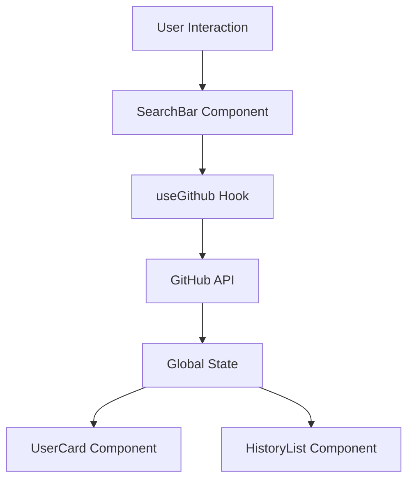

<div align="center">

# 🕵️‍♂️ GitHub Hunter

**Advanced GitHub User Explorer & Tracker**

[🚀 Demo](https://git-hub-hunter.vercel.app/) - [🐛 Issues](https://github.com/n3brrr/githubHunter/issues) - [📖 Docs](#documentation)

</div>

---

## ⚡ Overview

GitHub Hunter is a modern web application designed to seamlessly explore GitHub user profiles. Built with a robust React & TypeScript architecture, it provides real-time data fetching, search history tracking, and a sleek, responsive interface powered by TailwindCSS.

### ✨ Key Features

- 🔍 **Smart User Search** - Instant access to GitHub user profiles and stats
- 📜 **History Management** - Automatically tracks and saves your search history
- ⚡ **High Performance** - Powered by Vite for lightning-fast builds and HMR
- 🎨 **Modern Design** - Fully responsive UI with TailwindCSS v4
- 🛡️ **Type Safety** - Comprehensive TypeScript integration for reliability

### 🛠️ Tech Stack

<p align="left">


</p>

---

## � Installation

### Prerequisites

- Node.js 18+ (Recommended)
- npm or pnpm

### Quick Setup

```bash
# Clone repository
git clone https://github.com/n3brrr/githubHunter.git

# Navigate to directory
cd githubHunter

# Install dependencies
npm install

# Start Development Server
npm run dev

# Build for Production
npm run build
```

## 📁 Project Structure

```bash
githubHunter/
├── src/
│   ├── components/      # UI Components (SearchBar, UserCard, etc.)
│   ├── hooks/          # Custom hooks (useGithub)
│   ├── assets/         # Static assets
│   ├── App.tsx         # Main application component
│   └── types.ts        # TypeScript definitions
├── public/             # Public assets
├── index.html          # Entry HTML
├── vite.config.ts      # Vite configuration
└── package.json        # Dependencies and scripts
```

## 🔄 Architecture



## 💻 Usage

```typescript
// Example: Using the custom hook for data fetching
import useGithub from './hooks/useGithub';

const MyComponent = () => {
  const { user, loading, fetchUser } = useGithub();

  return (
    <button onClick={() => fetchUser('n3brrr')}>
      Search User
    </button>
  );
};
```

## 🧪 Scripts

```bash
# Start development server
pnpm run dev

# Build for production
pnpm run build

# Lint code
pnpm run lint

# Preview production build
pnpm run preview
```

## 👤 Author

**Rubén Torres** - [@n3brrr](https://github.com/n3brrr)

Frontend Developer | TypeScript Enthusiast

<div align="center">
⭐ Star this repo if you find it useful
</div>
